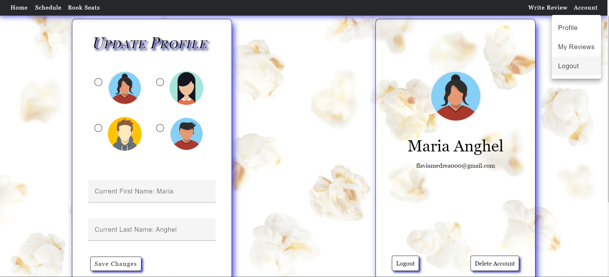

# Abstract
Cinema Web Application is created to make a pleasurable experience out of watching movies and foster a community of people who love watching and going to movies.
This web application combines a cinema booking system with a blog-like page for
users to read and leave movie reviews, helping others to make a decision when
choosing a movie to watch at the cinema. The web application has a user-friendly
interface, allowing users of any age to browse through movies and book tickets for
their preferred screenings.
A characteristic of Cinema Web Application is its movie review system, which encourages users to express their thoughts and opinions on the movies they watch.
By providing a platform for people to share reviews and insights, Cinema Web
Application fosters a community of movie lovers of all ages.

# Description of User Interface
The first page that opens is the ”Home” page which contains the reviews list.

Next, if the user clicks on ”Schedule” from the navigation bar another page
will open. On this page the schedule is displayed. The filter bar helps the user filter the movie schedule by day of the week. When hovering the cursor on the poster of the movie, the picture flips and on the backside the user can read the description of the movie.

Below the genres of the movie there is a ”Watch Trailer” button. When clicked,
the YouTube trailer appears. Along with the trailer appears a button called
”Hide Trailer” which makes the trailer disappear if clicked.

Next on the menu is page ”Book Seats” which contains a booking form for
the user who wants to book a spot.
After the movie, day and time have been chosen the user can pick any available
seat they like. For this the user does not need to have an account.

After successfully submitting, the user receives an e-mail with the ticket in
a PDF format.

For the users wanting to create an account there is ”Signup” page.
After submitting the form, an activation link is sent to the chosen e-mail address. After clicking the link, the account is activated and the user can log in.

After creating an account the ”Login” page helps the user log into their
account.

If the user does not remember the password, the ”Forgot Password” page comes
to help.
After submitting the form, a link is sent by e-mail which takes the user to the ”Reset Password” page. After submitting the ”Reset Password” form the
user can log into their account.

After logging in, the user will see a new page called ”Write Review”.

After writing a review the user can edit or delete the post they have created.
If the user has written any reviews they are available on the page ”My Reviews” which can be accessed by clicking on ”Account” option of the navigation bar.
”Account” then opens a menu with multiple options such as ”Profile”, ”My Reviews”, ”Logout”. By clicking ”My Reviews” the user can see the reviews they
have written.

When logged in the user can modify their name which appears public when
leaving a review by clicking on ”Account”, then click ”Profile” when the menu
opens. Choosing an avatar for their profile is also an option.
Logging out can be done from the menu that opens when clicking ”Account” in the top right corner or by clicking the buttons inside the profile card.
Deleting the account can be done from the ”Profile” page. The profile card has
the button ”Delete Account” which when clicked opens a message asking the
user to confirm whether or not they want to delete the account, this action being irreversible.

# Cinema

This project was generated with [Angular CLI](https://github.com/angular/angular-cli) version 16.0.0.

## Development server

Run `ng serve` for a dev server. Navigate to `http://localhost:4200/`. The application will automatically reload if you change any of the source files.

## Code scaffolding

Run `ng generate component component-name` to generate a new component. You can also use `ng generate directive|pipe|service|class|guard|interface|enum|module`.

## Build

Run `ng build` to build the project. The build artifacts will be stored in the `dist/` directory.

## Running unit tests

Run `ng test` to execute the unit tests via [Karma](https://karma-runner.github.io).

## Running end-to-end tests

Run `ng e2e` to execute the end-to-end tests via a platform of your choice. To use this command, you need to first add a package that implements end-to-end testing capabilities.

## Further help

To get more help on the Angular CLI use `ng help` or go check out the [Angular CLI Overview and Command Reference](https://angular.io/cli) page.
